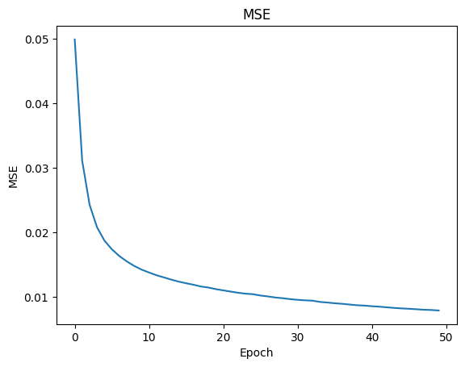
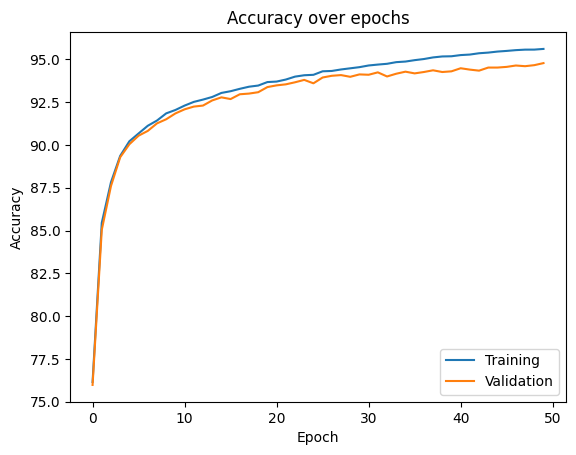
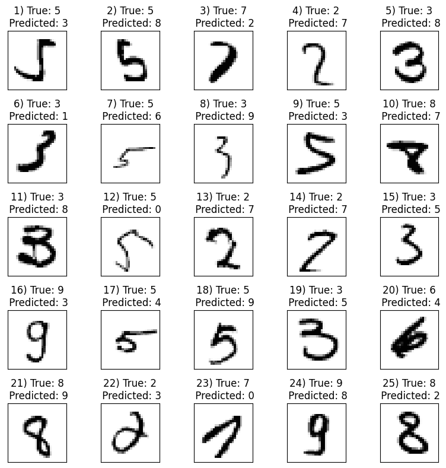

# Simple Neural Network from Scratch for MNIST Classification

This project demonstrates the implementation of a simple neural network from scratch in Python using **NumPy**. The network is trained on the classic **MNIST dataset**, which contains images of handwritten digits (0-9), and is aimed at building a foundational understanding of neural networks without the use of advanced machine learning libraries like TensorFlow or PyTorch.

> **Note**: This isn't meant to be the best possible solution for this project, but rather just learning how Neural networks work.

<!-- Set big NOTE -->
> **Note**: To see an implementation of this with PyTorch, look at my other project: [Number mnist with PyTorch](https://github.com/driessenslucas/numbers_mnist)

<!-- folding note -->
<details>
<summary>Sneak peek of the PyTorch implementation</summary>


</details>

## Project Overview

The key components of this project include:
- Implementation of a simple neural network with a single hidden layer.
- Forward pass and backpropagation for training the network.
- Mean Squared Error (MSE) loss and accuracy as evaluation metrics.
- Training loop with mini-batch gradient descent.
- Visualizing training performance and misclassified images.

## Features
1. **Sigmoid Activation**: A standard activation function used to introduce non-linearity in the neural network.
2. **One-hot Encoding**: Converts integer labels to binary matrix representation for multi-class classification.
3. **Backpropagation**: Gradient computation for updating weights and biases using MSE loss.
4. **Mini-batch Gradient Descent**: A method to train the neural network using small subsets of data.
5. **Training Visualization**: Plotting of training loss and accuracy over epochs, including visualization of misclassified images.

## Project Files

- **`neuralnet.py`**: Contains the `NeuralNetMLP` class, including the forward and backward pass functions.
- **`train.py`**: A script that loads the MNIST dataset, preprocesses it, initializes the neural network, and performs the training.
- **Visualization**: Code snippets to visualize both the training process and the network's performance.

## Installation

To set up the environment, install the required dependencies:

```bash
pip install numpy matplotlib scikit-learn
```

## Usage

1. **Load the Data**: The dataset is fetched using `scikit-learn`'s `fetch_openml` method for the MNIST data.

2. **Preprocess the Data**:
   - Normalize pixel values from [0, 255] to [-1, 1].
   - Split data into training, validation, and test sets.

3. **Train the Model**:
   - Initialize the neural network with `NeuralNetMLP`.
   - Use the `train()` function to train the network over a specified number of epochs.
   - Monitor MSE loss and accuracy metrics for both training and validation data.

4. **Visualize Training**:
   - Plot MSE loss and accuracy across epochs.
   - Display examples of misclassified images after training.

## Example Code Snippet

Here's a snippet demonstrating how to initialize and train the network:

```python
from neuralnet import NeuralNetMLP

# Initialize the model with input features, hidden neurons, and output classes
model = NeuralNetMLP(num_features=784, num_hidden=50, num_classes=10)

# Train the model for 50 epochs with a learning rate of 0.1
epoch_loss, epoch_train_acc, epoch_valid_acc = train(
    model, X_train, y_train, X_valid, y_valid, num_epochs=50, learning_rate=0.1
)
```

## Results

After training the model, the validation accuracy is printed, and plots for MSE loss and accuracy over epochs are displayed. Misclassified images are also visualized to understand where the network makes mistakes.

## Visualization Examples

### Training Loss and Accuracy



### Misclassified Digits


## Dataset

The dataset used is **MNIST**, a classic dataset for machine learning and computer vision tasks. It contains 70,000 images of handwritten digits (0 to 9), each image being 28x28 pixels in grayscale.

## How it Works

1. **Forward Pass**: Computes the outputs for the hidden and output layers using matrix multiplication and applies the sigmoid activation function.
2. **Backpropagation**: Computes gradients of the loss function with respect to weights and biases to update them.
3. **Mini-batch Gradient Descent**: Uses subsets of data to perform weight updates, making the training process faster and more memory efficient.

## Future Improvements

- Implement a more advanced activation function like ReLU.
- Add support for multiple hidden layers.
- Implement a softmax activation function for the output layer to improve classification.
- Experiment with different loss functions and optimizers like Adam.
- Save and load trained model parameters.